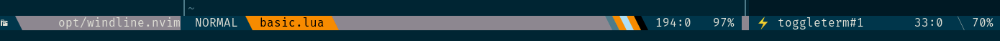
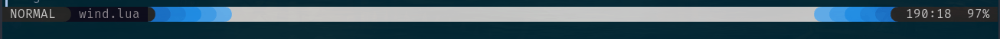

# Windline
 The next generation statusline for neovim

 * custom statusline for filetype
 * builtin animation library
 * change colors with colorscheme
 * simple syntax

# Intro

Firstly create a statusline in lua is easy and you can do it with some line
code. There are many lua statusline but they do the samething of vimscript statusline.
Sadly but true It doesn't have anything new

Windline is a first statusline support change statusline per filetype.
You can write a statusline for any filetype.
`terminal,nvimtree, qf,spectre,lsptrouble,diffview,lspoutline`.
If you write a plugin you can define a statusline for your plugin.
It support to update on inactive window

```lua

local yourstatus = {
    filetypes = {'lspcrazy'},
    active = {
        {' lspcrazy ', {'white', 'black'} },
        {function() return 'crazy' end ,{'black', 'red'} },
    },
    show_in_active = true
}

```

We offfer an builtin animation color library for stausline.
I know it is not useful but why not :).
It is not loaded if you don't use animation


 **Warning**
 We don't have anything call provider so you need to do it.

# Setup

```lua
local windline = require('windline')
windline.setup({
  statuslines = {--- you need define your statusline here }
})

```


[code](./lua/wlsample/basic.lua)



[code](./lua/wlsample/wind.lua)


# statusline

you need to define a default statusline it will apply to all filetypes.
```lua
local default = {
    filetypes={'default'},
    active={
      --- component...
    },
    in_active={
      --- component...
    }
}

local explorer = {
    filetypes = {'fern', 'NvimTree','netrw'},
    active = {
        {'  ', {'white', 'black'} },
    },
    show_in_active = true
    -- set this mean if it is inactive it still display same as active mode
}

```

# components
An component define with {text ,{fgcolor,bgcolor} }

```lua

local default = {
    filetypes={'default'},
    active={
      --- component...
      {'',{'white', 'InactiveBg'}},
      {"%=", ''}
    },
}
```

**Every component have own hightlight name define in hl_colors function**
**A hl function return a name in hl_colors function you can use it to toggle mode**
**A text function has a bufnr parameter and you can use it to get data from buffer**

you can define a component like this.
```lua
vim.g.windlinecount = 1

local count = {
  hl_colors = {
        countRed     = {'black', 'red'},
        countNormal  = {'black', 'green'}
  },
  hl = function(hl_colors)
      if vim.g.windlinecount > 50 then
        return hl_colors.countRed
      end
      return hl_colors.countNormal
  end,
  text = function(bufnr)
    vim.g.windlinecount = vim.g.windlinecount + 1
    if vim.g.windlinecount > 99 then
      vim.g.windlinecount = 1
    end
    return ' ' .. vim.fn.strftime("%H:%M:%S") .. ' '
  end,
}
```

A text function can return a group of child component,
child component shared hl_colors data with parent component


```lua
local terminal_mode =  {
    name='terminal',
    text = function ()
        if
            vim.g.statusline_winid == vim.api.nvim_get_current_win()
            and state.mode[1] == 'TERMINAL'
        then
            return {
                {' ⚡ ', function(hl_data) return hl_data[state.mode[2]] end},
                {'', 'sep'}
            }
        end
        return {
            {' ⚡ ','empty'} -- empty come from hl_colors
        }
    end,
    hl_colors = {
        Normal  = {'ActiveFg', 'ActiveBg'   } ,
        sep     = {'red', 'InactiveBg'},
        Command = {'white', 'red' } ,
        empty   = {'white', 'black'},
    },
}
```

# Colors
windline use a terminal color.It generate from your colorscheme terminal.
Every time you change colorschemes it will be generate.

color name is use to define component and animation

``` lua
-- sample
local colors = {
  black         = "",
  red           = "",
  green         = "",
  yellow        = "",
  blue          = "",
  magenta       = "",
  cyan          = "",
  white         = "",
  black_light   = "",
  red_light     = "",
  yellow_light  = "",
  blue_light    = "",
  magenta_light = "",
  green_light   = "",
  cyan_light    = "",
  white_light   = "",

  ActiveFg      = "",
  ActiveBg      = "",
  InactiveFg    = "",
  InactiveBg    = "",
}
return colors
```

if you need to define a new name of color to use on animation you need define
on colors_name function

```lua

local windline = require('windline')

windline.setup({

  colors_name = function(colors)
      colors.FilenameFg = colors.white_light    --- add more color
      colors.FilenameBg = colors.black
      return colors
  end,

})
```

## animation
animation with colors_name from colors above
``` lua
animation.animation({
   data = {
        {'red_light',efffects.rainbow()},
        {'green_light',efffects.rainbow()},
        {'cyan_light',efffects.blackwhite()},
        {'FilenameBg',efffects.rainbow()},
        {'FilenameFg',efffects.blackwhite()}
    },
    timeout = 10,
    delay = 200,
    interval = 100,
})

you can create a multi animation but only list of data on animation is sync
```

### effects

| Usage                      | KEY                                   |
|----------------------------|---------------------------------------|
| rainbow()                  | a rainbow animation color             |
| blackwhite()               | toggle between black and white        |
| list_color({..list_color}) | swap color from list                  |
| flashyH([number 0-360])    | increase H on every step of animation |
| flashyS([number 0.01 - 1)  | increase S on every step of animation |
| flashyL([number 0.01 - 1)  | increase L on every step of animation |

```lua
-- you can write your own effect
local Hsl = require('wlanimation.hsl')
animation.animation({
   data = {
        {'red',efffects.wrap(function(color)
            return HSL.new(color.H + 1, color.S, color.L)
        end)},
    },
    timeout = 100,
    delay = 200,
    interval = 100,
})
```

